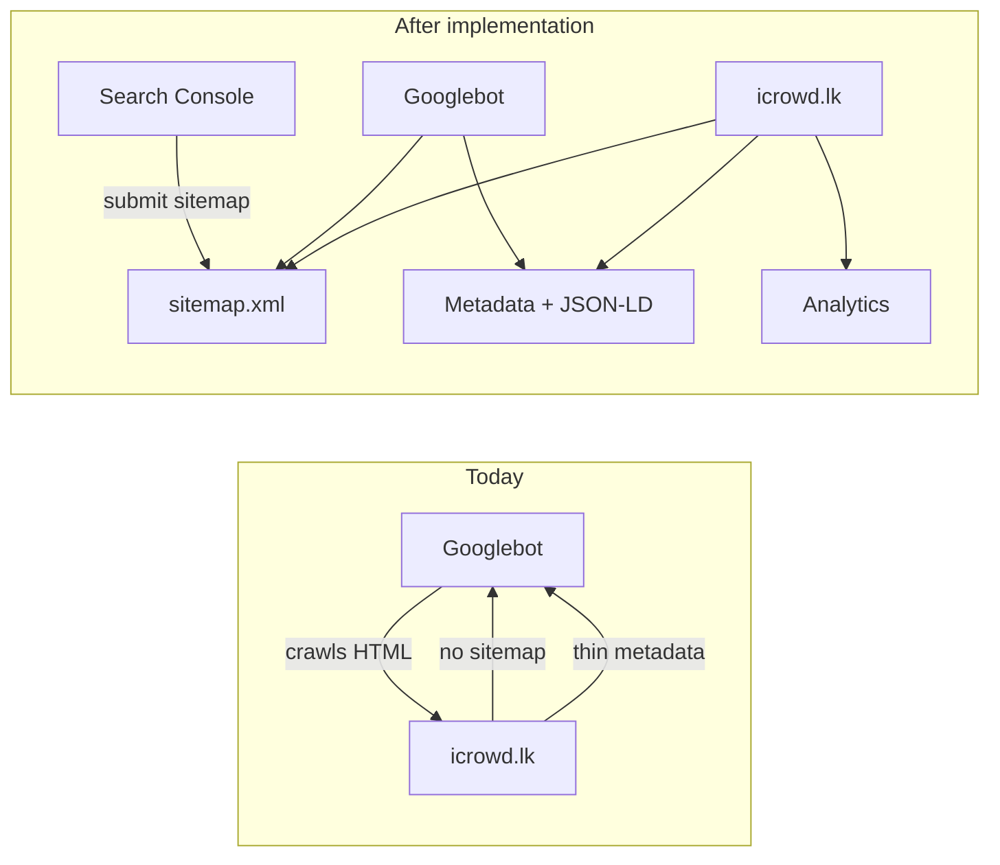

# Google SEO for iCrowd

## Current state

The storefront ([`apps/web`](apps/web)) has **minimal SEO only**:

- Root title/description in [`apps/web/src/app/layout.tsx`](apps/web/src/app/layout.tsx)
- Per-page titles on ~8 routes; product pages have **title only**
- **No** `sitemap.xml`, `robots.txt`, Open Graph, Twitter cards, canonical URLs, JSON-LD, or analytics
- Footer links to **404 pages**: `/about`, `/terms`, `/faq` ([`apps/web/src/components/layout/Footer.tsx`](apps/web/src/components/layout/Footer.tsx))
- Production deploy scripts still default `NEXT_PUBLIC_APP_URL` to `http://icrowd.lk` — must be `https://icrowd.lk` for correct canonical/OG URLs



---

## 1. SEO foundation — shared helper + root metadata

**New file:** [`apps/web/src/lib/seo.ts`](apps/web/src/lib/seo.ts)

Centralize metadata building using `clientEnv.NEXT_PUBLIC_APP_URL` from [`packages/env/src/index.ts`](packages/env/src/index.ts):

- `siteUrl()` — returns `new URL(NEXT_PUBLIC_APP_URL)`
- `buildPageMetadata({ title, description, path, image?, noIndex? })` — sets:
  - `metadataBase` (caller sets once in root)
  - `alternates.canonical`
  - `openGraph` (title, description, url, siteName, images, locale `en_LK`)
  - `twitter.card` (`summary_large_image`)
  - optional `robots: { index: false }`

**Update:** [`apps/web/src/app/layout.tsx`](apps/web/src/app/layout.tsx)

- Add `metadataBase: new URL(clientEnv.NEXT_PUBLIC_APP_URL)`
- Add default Open Graph + Twitter from existing site description
- Add `verification.google` from new env var (see section 6)
- Fix **duplicate title bug**: child pages currently pass `"Product Name | iCrowd"` while root template is `"%s | iCrowd"` → results in `"Product Name | iCrowd | iCrowd"`. Use `title: "Product Name"` (let template add suffix) or `title: { absolute: "..." }` for pages that need full control.

**Update:** [`apps/web/src/app/(store)/layout.tsx`](apps/web/src/app/(store)/layout.tsx)

- Add `generateMetadata` that loads store settings ([`getOrCreateStoreSettings`](packages/database/src/queries/storeSettings.ts)) and sets `openGraph.siteName`, `icons` from `faviconUrl`, and default OG image from `logoUrl` when available.

---

## 2. Sitemap and robots

**New file:** [`apps/web/src/app/sitemap.ts`](apps/web/src/app/sitemap.ts)

Next.js MetadataRoute.Sitemap that queries the DB:

| URL pattern | Priority | Source |
|-------------|----------|--------|
| `/` | 1.0 | static |
| `/products`, `/categories`, `/offers`, `/contact` | 0.8 | static |
| `/about`, `/terms`, `/faq` | 0.5 | static (new pages) |
| `/products/{slug}` | 0.9 | active products |
| `/products/brands/{slug}` | 0.7 | active brands |
| `/products?category={slug}` | 0.6 | active categories |

**New lightweight DB helpers** in [`packages/database/src/queries/products.ts`](packages/database/src/queries/products.ts) (or a small `sitemap.ts` query file):

```ts
// slug + updatedAt only — avoids loading images/relations
getActiveProductSitemapEntries()
getActiveBrandSitemapEntries()  // reuse getBrands()
getActiveCategorySitemapEntries() // reuse getCategories()
```

Use `revalidate = 3600` on sitemap (hourly refresh is fine for SEO).

**New file:** [`apps/web/src/app/robots.ts`](apps/web/src/app/robots.ts)

```
User-agent: *
Allow: /
Disallow: /admin, /operator, /api, /checkout, /cart, /wishlist, /track, /account
Sitemap: https://icrowd.lk/sitemap.xml
```

---

## 3. Rich per-page metadata

Apply `buildPageMetadata()` across indexable storefront routes:

| Page | File | Enhancements |
|------|------|--------------|
| Home | [`(store)/page.tsx`](apps/web/src/app/(store)/page.tsx) | Add `generateMetadata` with Sri Lanka-focused description + Organization JSON-LD |
| Products listing | [`products/page.tsx`](apps/web/src/app/(store)/products/page.tsx) | Description, canonical `/products` |
| Product detail | [`products/[slug]/page.tsx`](apps/web/src/app/(store)/products/[slug]/page.tsx) | Description from `shortDescription`, OG image from primary product image (`normalizeProductImageUrl`), Product JSON-LD |
| Brand listing | [`products/brands/[slug]/page.tsx`](apps/web/src/app/(store)/products/brands/[slug]/page.tsx) | Canonical, OG |
| Categories | [`categories/page.tsx`](apps/web/src/app/(store)/categories/page.tsx) | Description |
| Offers, Contact | existing files | Fix title suffix; add OG |

**Product JSON-LD** (inline `<script type="application/ld+json">` in product page server component):

```json
{
  "@type": "Product",
  "name", "description", "image", "sku",
  "offers": { "@type": "Offer", "price", "priceCurrency": "LKR", "availability" },
  "aggregateRating": { ... }  // when reviewCount > 0
}
```

**BreadcrumbList JSON-LD** on product pages (Home → Products → Product name).

**Noindex transactional pages** via small server layouts:

- New `cart/layout.tsx`, `wishlist/layout.tsx`, `track/layout.tsx` with `robots: { index: false, follow: false }`
- Update existing [`checkout/layout.tsx`](apps/web/src/app/(store)/checkout/layout.tsx) similarly
- Add `noindex` to [`(admin)/admin/layout.tsx`](apps/web/src/app/(admin)/admin/layout.tsx) and [`(operator)/operator/layout.tsx`](apps/web/src/app/(operator)/operator/layout.tsx)

---

## 4. Missing footer pages (fix 404s hurting crawl quality)

Create server-rendered ISR pages under `(store)`:

| Route | File | Content source |
|-------|------|----------------|
| `/terms` | `(store)/terms/page.tsx` | `store_settings.policies.terms` (HTML from admin [`PoliciesTab`](apps/web/src/app/(admin)/admin/settings/tabs/PoliciesTab.tsx)) |
| `/about` | `(store)/about/page.tsx` | Store name, address, support phone/email, social links from `store_settings` |
| `/faq` | `(store)/faq/page.tsx` | Starter FAQ content (5–8 common e-commerce Q&As for mobile/accessories shop); structured with semantic `<h2>` + `<details>` for crawlability |

**Shared component:** `PolicyContent.tsx` — safely renders admin HTML (same pattern as email templates; sanitize or trust admin-only input).

Add `generateMetadata` on each with unique title + description.

---

## 5. Environment variables

Add to [`packages/env/src/index.ts`](packages/env/src/index.ts) client schema (optional, empty-string allowed):

| Variable | Purpose |
|----------|---------|
| `NEXT_PUBLIC_GA_MEASUREMENT_ID` | GA4 `G-XXXXXXXX` |
| `NEXT_PUBLIC_GOOGLE_SITE_VERIFICATION` | GSC HTML meta verification token |

**Production:** set `NEXT_PUBLIC_APP_URL=https://icrowd.lk` in server `.env` and update [`scripts/upload-env.sh`](scripts/upload-env.sh) / [`scripts/deploy-almalinux.sh`](scripts/deploy-almalinux.sh) defaults from `http://` to `https://`.

Document new vars in a short comment block in [`apps/web/.env.local`](apps/web/.env.local) (not committed secrets).

---

## 6. Google Search Console verification

In root layout metadata:

```ts
verification: {
  google: process.env.NEXT_PUBLIC_GOOGLE_SITE_VERIFICATION || undefined,
}
```

**Post-deploy steps (manual, one-time):**

1. Go to [Google Search Console](https://search.google.com/search-console)
2. Add property `https://icrowd.lk`
3. Choose **HTML tag** verification → copy the `content="..."` value into `NEXT_PUBLIC_GOOGLE_SITE_VERIFICATION`
4. Redeploy, click Verify in GSC
5. Submit `https://icrowd.lk/sitemap.xml`
6. Use URL Inspection to request indexing for `/`, top categories, and 2–3 flagship product URLs

---

## 7. Google Analytics 4

**New file:** [`apps/web/src/components/analytics/GoogleAnalytics.tsx`](apps/web/src/components/analytics/GoogleAnalytics.tsx)

- Client component using `next/script` with `strategy="afterInteractive"`
- Only renders when `NEXT_PUBLIC_GA_MEASUREMENT_ID` is set and `NODE_ENV === 'production'`
- Standard GA4 `gtag.js` snippet

**Wire into:** [`apps/web/src/app/layout.tsx`](apps/web/src/app/layout.tsx) inside `<body>`.

---

## 8. Verification checklist

After deploy to `https://icrowd.lk`:

- [ ] View source on home — confirm `<title>`, `og:title`, `og:image`, canonical
- [ ] Visit `/robots.txt` and `/sitemap.xml` — confirm URLs use `https://`
- [ ] Rich Results Test on a product URL — Product schema validates
- [ ] GSC verified + sitemap submitted
- [ ] GA4 Realtime shows pageviews
- [ ] `/about`, `/terms`, `/faq` return 200 (no footer 404s)

---

## Files changed (summary)

| Action | Path |
|--------|------|
| Create | `apps/web/src/lib/seo.ts` |
| Create | `apps/web/src/app/sitemap.ts`, `robots.ts` |
| Create | `(store)/about/page.tsx`, `terms/page.tsx`, `faq/page.tsx` |
| Create | `components/analytics/GoogleAnalytics.tsx`, `components/storefront/PolicyContent.tsx` |
| Create | `cart/layout.tsx`, `wishlist/layout.tsx`, `track/layout.tsx` (noindex) |
| Update | `layout.tsx`, `(store)/layout.tsx`, product/brand/category pages |
| Update | `packages/env`, deploy scripts, DB sitemap query helpers |

No database migration needed for core SEO. FAQ can start as static content; optional future enhancement: `store_settings.faq` JSONB + admin tab.
